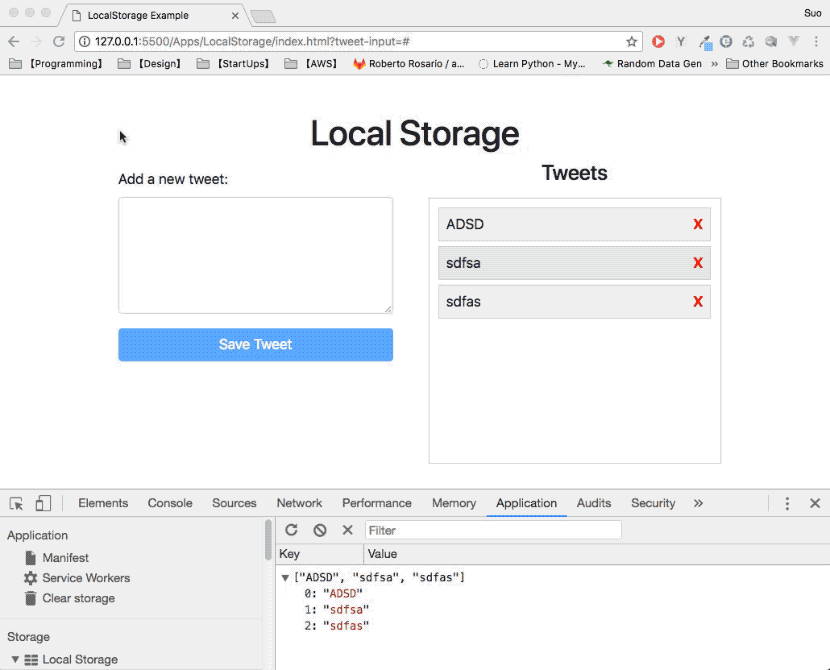

# A simple Tweet Application using LocalStorage

#### Requirements:

- Can add and save a tweet context
- Show all the tweets in a list
- Can remove a chosen tweet from the list
- After refreshing the page, saved tweets are loaded.

#### Final result:



#### Source code

The source code for this app can be found [here](../LocalStorage)

### Summary & Tips

1.  `.appendChild(el)` only works on a **HTML Node**, which means `el` must be a **Node**, e.g., `div`, `li`. The following won't work:

```js
const tweet = `<li class="tweet">${tweetInput.value}<\li>`; // string
tweetList.appendChild(tweet); // Uncaught TypeError: Failed to execute 'appendChild' on 'Node': parameter 1 is not of type 'Node'
```

`tweet` here is a _string_, not a **Node**. Therefore, `tweetList.appendChild(tweet);` will threw an error.

You must use `document.createElement()` to create a **Node** before using `appendChild()`.

```js
// create an <li> element
const li = document.createElement("li");
li.textContent = tweet;
tweetList.appendChild(li);
```

2.  Use `JSON.stringify(array)` to convert array to string before writing to _localStorage_, and use `JSON.parse(valueFromStorage)` to convert string to array.

```js
// convert array to string before save to localStorage
localStorage.setItem("tweets", JSON.stringify(existingTweets));

// convert string to array to use
let tweets = JSON.parse(localStorage.getItem("tweets"));
```
