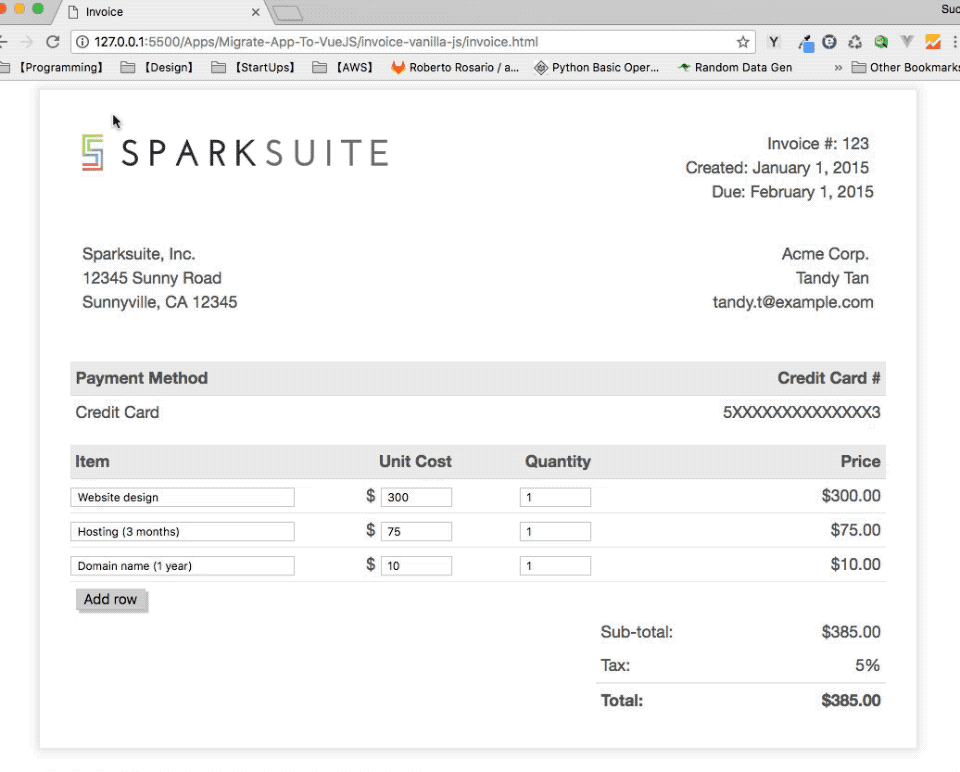

# Migrate an App to VueJS

> This application is much inspired by this article [Replacing jQuery with Vue](https://www.sitepoint.com/replacing-jquery-vue/). However, jQuery is not used in my application.

## Requirements:

- Use this (open-source template from Sparksuite)[https://github.com/sparksuite/simple-html-invoice-template] as a start
- Program in both the declarative programming paradigm and imperative programming paradigm
- User can add new items
- User can add change an items information
- Recalculate the prices whenever a user changes an item's unit cost or quantity

#### The vanilla JavaScript implementation

