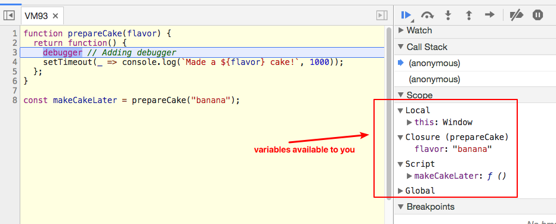

# Closures

Whenever you create _a function within another function_, you have created a **closure**. **The inner function is the closure**. This closure is usually returned so you can use the outer function's variables at a later time.

```js
function outerFunction() {
  const outer = `I see the outer variable!`;

  function innerFunction() {
    console.log(outer);
  }

  return innerFunction;
}

outerFunction()(); // pay attention to the double '()'
```

> **Output:**  
> `I see the outer variable!`

Since the inner function is returned, you can also shorten the code a little by writing a return statement while declaring the function.

```js
function outerFunction() {
  const outer = `I see the outer variable!`;

  return function innerFunction() {
    console.log(outer);
  };
}

outerFunction()(); // I see the outer variable!
```

Since closures have access to the variables in the outer function, they are usually used for two things:

* To control side effects
* To create private variables

## Controlling side effects with closures

Side effects happen when you do something in aside from returning a value from a function. Many things can be side effects, like an Ajax request, a timeout or even a `console.log` statement. When you use closures to control side effects, you're usually concerned with ones that can mess up your code flow like _Ajax_ or _timeouts_.

Let's go through this with an example to make things clearer.

Let's say you want to make a cake for your friend's birthday. This cake would take a second to make, so you wrote a function that logs `made a cake` after one second.

```js
function makeCake() {
  setTimeout(_ => console.log(`Made a cake`), 1000);
}
```

As you can see, this cake making function has a side effect: a timeout.

Let's further say you want your friend to choose a flavor for the cake. To do so, you can write add a flavor to your `makeCake` function.

```js
// ES6
function makeCake(flavor) {
  setTimeout(_ => console.log(`Made a ${flavor} cake!`, 1000));
}

makeCake("banana"); // Made a banana cake!
```

When you run the function, notice the cake gets made **immediately**.

The problem here is that you don't want to make the cake _immediately_ after knowing the flavor. You want to make it later when the time is right.

To solve this problem, you can write a `prepareCake` function that stores your flavor. Then, return the `makeCake` closure within `prepareCake`.

```js
function prepareCake(flavor) {
  return function() {
    setTimeout(_ => console.log(`Made a ${flavor} cake!`, 1000));
  };
}

const makeCakeLater = prepareCake("banana");

// And later in your code...
makeCakeLater();
// Made a banana cake!
```

From this point on, you can call the returned function whenever you want to, and the cake will be made _within a second_. That's how closures are used to reduce side effects – you create a function that activates the inner closure at your whim.

### Private variables with closures

As you know by now, variables created in a function cannot be accessed outside the function. Since they can't be accessed, they are also called **private variables**.

However, sometimes you need to access such a private variable. You can do so with the help of closures.

```js
function secret(secretCode) {
  return {
    saySecretCode() {
      console.log(secretCode);
    }
  };
}

const theSecret = secret("Closure in JS is hard");
theSecret.saySecretCode(); // Closure is hard!
```

> **Outputs:**  
> `Closure is hard!`

`saySecretCode` in this example above is the only function (**a closure**) that exposes the `secretCode` outside the original `secret` function. As such, it is also called a _privileged function_.

## Debugging scopes with DevTools

Chrome and Firefox's DevTools make it simple for you to debug variables you can access in the current scope.

The first way is to add the `debugger` keyword in your code. This causes JavaScript execution in browsers to pause so you can debug.

Here's an example with the `prepareCake`:

```js
function prepareCake(flavor) {
  return function() {
    debugger; // Adding debugger
    setTimeout(_ => console.log(`Made a ${flavor} cake!`, 1000));
  };
}

const makeCakeLater = prepareCake("banana");
makeCakeLater();
```

If you open your DevTools and navigate to the Sources tab in Chrome (or Debugger tab in Firefox), you would see the variables available to you.



## Wrapping Up

If you define any inner function within another function, this inner function is called a closure. It retains access to the variables created in the outer function.

A closure is a function having access to the parent scope, even after the parent function has closed.
