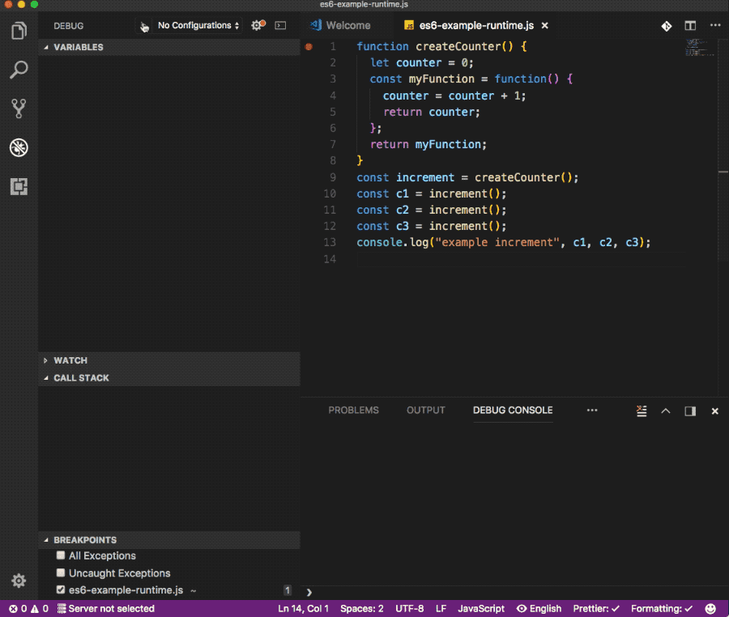

# Explanation of Closure in Action

After the basic introduction to Closure, it is still vague to understand how it works in real example. This section gives a details step-by-step explanation on closure in action, which is coming from this great article: [I never understood JavaScript closures, Until someone explained it to me like this …](https://medium.com/dailyjs/i-never-understood-javascript-closures-9663703368e8)

## Closure in action

As mention in previous section, when a function gets declared, it contains a **function definition** and a **closure**. **_The closure is a collection of all the variables in scope at the time of creation of the function._**

Take a look at the example below:

```js
 1:  function createCounter() {
 2:    let counter = 0;
 3:    const myFunction = function() {
 4:      counter = counter + 1;
 5:      return counter;
 6:    };
 7:    return myFunction;
 8:  }
 9:  const increment = createCounter();
10:  const c1 = increment();
11:  const c2 = increment();
12:  const c3 = increment();
13:  console.log("example increment", c1, c2, c3);
```

Let's look at the **_WRONG WAY_** of understanding of the step-by-step process, as many might expected.

### Wrong perceived process

1.  Lines 1–8. We create a new variable `createCounter` in the global execution context and it get’s assigned function definition.

2.  Line 9. We declare a new variable named `increment` in the global execution context.

3.  Line 9 again. We need call the `createCounter` function and assign its returned value to the `increment` variable.

4.  Lines 1–8 . Calling the function. Creating new local execution context.

5.  Line 2. Within the local execution context, declare a new variable named `counter`. Number `0` is assigned to `counter`.

6.  Line 3–6. Declaring new variable named `myFunction`. The variable is declared in the local execution context. The content of the variable is yet another function definition. As defined in lines 4 and 5.

7.  Line 7. Returning the content of the `myFunction` variable. Local execution context is deleted. `myFunction` and `counter` no longer exist. Control is returned to the calling context.

8.  Line 9. In the calling context, the global execution context, the value returned by `createCounter` is assigned to `increment`. The variable `increment` now contains a function definition. The function definition that was returned by `createCounter`. It is no longer labeled `myFunction`, but it is the same definition. Within the global context, it is labeled`increment`.

9.  Line 10. Declare a new variable `c1`.

10. Line 10 (continued). Look up the variable `increment`, it’s a function, call it. It contains the function definition returned from earlier, as defined in lines 4–5.

11. Create a new execution context. There are no parameters. Start execution the function.

12. Line 4. `counter = counter + 1`. Look up the value `counter` in the local execution context. We just created that context and never declare any local variables. Let’s look in the global execution context. No variable labeled `counter` here. Javascript will evaluate this as `counter = undefined + 1`, declare a new local variable labeled `counter` and assign it the number `1`, as undefined is sort of `0`.

13. Line 5. We return the content of `counter`, or the number 1. We destroy the local execution context, and the `counter` variable.

14. Back to line 10. The returned value (`1`) gets assigned to `c1`.

15. Line 11. We repeat steps 10–14, `c2` gets assigned 1 also.

16. Line 12. We repeat steps 10–14, `c3` gets assigned 1 also.

17. Line 13. We log the content of variables `c1`, `c2` and `c3`.

Try this out for yourself and see what happens. You’ll notice that it is not logging `1`, `1`, and `1` as you may expect from the explanation above. Instead it is logging `1`, `2` and `3`. So what gives?

Somehow, the `increment` function remembers that `counter` value. How is that working?

Is `counter` part of the global execution context? Try console.log(counter) and you’ll get undefined. So that’s not it.

Maybe, when you call `increment`, somehow it goes back to the the function where it was created (`createCounter`)? How would that even work? The variable increment contains the function definition, not where it came from. So that’s not it.

So there must be another mechanism: the **`Closure`**.

Here is how it works. Whenever you declare a new function and assign it to a variable, you store the function definition, as well as a closure. The closure contains all the variables that are in scope at the time of creation of the function. It is analogous to a backpack. A function definition comes with a little backpack. And in its pack it stores all the variables that were in scope at the time that the function definition was created.

### Correct Process with the `Closure`

So the explanation above was _all wrong_, let’s try it again, but **correctly this time**.

1.  Lines 1–8. We create a new variable `createCounter` in the global execution context and it get’s assigned function definition. Same as above.

2.  Line 9. We declare a new variable named `increment` in the global execution context. Same as above.

3.  Line 9 again. We need call the `createCounter` function and assign its returned value to the `increment` variable. Same as above.

4.  Lines 1–8 . Calling the function. Creating new local execution context. Same as above.

5.  Line 2. Within the local execution context, declare a new variable named `counter`. Number `0` is assigned to `counter`. Same as above.

6.  Line 3–6. Declaring new variable named `myFunction`. The variable is declared in the local execution context. The content of the variable is yet another function definition. As defined in lines 4 and 5. **_Now we also create a closure_** and include it as part of the function definition. **_The closure contains the variables that are in scope_**, in this case the variable `counter` (with the value of `0`).

7.  Line 7. Returning the content of the `myFunction` variable. Local execution context is deleted. `myFunction` and `counter` no longer exist. Control is returned to the calling context. So we are returning the function definition and its closure, the backpack with the variables that were in scope when it was created.

8.  Line 9. In the calling context, the global execution context, the value returned by `createCounter` is assigned to `increment`. The variable `increment` now contains a function definition (and closure). The function definition that was returned by `createCounter`. It is no longer labeled `myFunction`, but it is the same definition. Within the global context, it is called `increment`.

9.  Line 10. Declare a new variable `c1`.

10. Line 10 (continued). Look up the variable `increment`, it’s a function, call it. It contains the function definition returned from earlier, as defined in lines 4–5. (and it also has a backpack with variables)

11. Create a new execution context. There are no parameters. Start execution the function.

12. Line 4. `counter = counter + 1`. We need to look for the variable `counter`. **_Before we look in the local or global execution context, let’s look in our backpack_**. Let’s check the closure. Lo and behold, the closure contains a variable named `counter`, its value is `0`. After the expression on line 4, its value is set to `1`. And it is stored in the backpack again. The closure now contains the variable `counter` with a value of `1`.

13. Line 5. We return the content of `counter`, or the number `1`. We destroy the local execution context.

14. Back to line 10. The returned value (`1`) gets assigned to `c1`.

15. Line 11. We repeat steps 10–14. This time, when we look at our closure, we see that the `counter` variable has a value of `1`. It was set in step 12 or line 4 of the program. Its value gets incremented and stored as `2` in the closure of the `increment` function. And `c2` gets assigned `2`.

16. Line 12. We repeat steps 10–14, `c3` gets assigned `3`.

17. Line 13. We log the content of variables `c1`, `c2` and `c3`.

The following animated gif shows the process of Closure in action:


So now we understand how this works. When a function returns a function, that is when the concept of closures becomes more relevant. The returned function has access to variables that are not in the global scope, but they solely exist in its closure.
