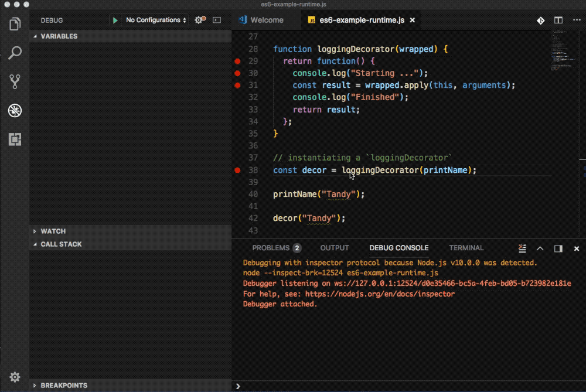

# Object Decorator Pattern

In OOP, the **decorator pattern** (also known as **Wrapper**, an alternative naming shared with the **Adapter** pattern) is _a design pattern that allows behavior to be added to an individual object, either statically or dynamically, without affecting the behavior of other objects from the same class_. ([source](https://en.wikipedia.org/wiki/Decorator_pattern))

In python (I personally know), a decorator is **a function** that _takes another function_ and _extends the behavior_ of the latter function without explicitly modifying it.

Put simply, **_decorators wrap a function, modifying its behavior_**. A decorator in python

```python
// python
def viking_chorus(myfunc):
    def inner_func(*args, **kwargs):
        for i in range(8):
            myfunc(*args, **kwargs)
    return inner_func

@viking_chorus  # <-- decorator
def menu_item():
    print("spam")
```

The above code translates to:

```python
# python
def menu_item():
    print("spam")
menu_item = viking_chorus(menu_item)
```

As can be seen, the decorator is basically just a cool kid’s way of calling higher-order functions, which is _beyond_ easy in JavaScript.

JavaScript is setting its sights on something else — **classes** and **properties**.

## Decorator in Action

In ES6/ES2015, decorators are pure functions, not in the `@decoratorFunction` way. In ES7/ES2016, the decorator has been finalized. Decorator is an expression which returns function and can take a target, name and property descriptor as arguments.

Here, only the pure standard JavaScript style is introduced, i.e., simply by calling on one function to wrap another:

```js
function printName(name) {
  console.log("Hello, " + name);
}

function loggingDecorator(wrapped) {
  return function() {
    console.log("Starting ...");
    const result = wrapped.apply(this, arguments);
    console.log("Finished!");
    return result;
  };
}

// instantiating a `loggingDecorator`
const decor = loggingDecorator(printName);
```

This example produces a new function — in the variable `decor` — that can be called exactly the same way as the `printName` function, and will do exactly the same thing. The difference is that it will do some logging before and after the wrapped function is called:

```js
printName("Tandy");
// Hello, Tandy

decor("Tandy");
// Starting ...
// Hello, Tandy
// Finished!
```

Please refer to the follow animated gif for decorator in action. Please pay attention the the **closure** as well.



## How to Use JavaScript Decorators

Decorators use a special syntax in JavaScript, whereby they are prefixed with an `@` symbol and placed immediately before the code being decorated. FYI, the `@` symbol is not available in ES6/ES2015.

It’s possible to use as many decorators on the same piece of code as you desire, and they’ll be applied in the order that you declare them.

For example:

```js
@log() // <-- class decorator
@immutable() // <-- class decorator
class Example {
  @time("demo") // <-- property decorator
  doSomething() {
    //
  }
}
```

This defines a class and applies three decorators — two to the **class** itself, and one to a **property** of the class:

* `@log` could log all access to the class
* `@immutable` could make the class immutable — maybe it calls `Object.freeze` on new instances
* `@time` will record how long a method takes to execute and log this out with a unique tag.

At present, using decorators requires transpiler support, since no current browser or Node release has support for them yet.

It is suggested to use the pure function style for the time being. If you’re using Babel, this is enabled simply by using the [transform-decorators-legacy plugin](https://github.com/loganfsmyth/babel-plugin-transform-decorators-legacy). You can also refer to [Decorators Transform](https://babeljs.io/docs/plugins/transform-decorators/) from Babel.
